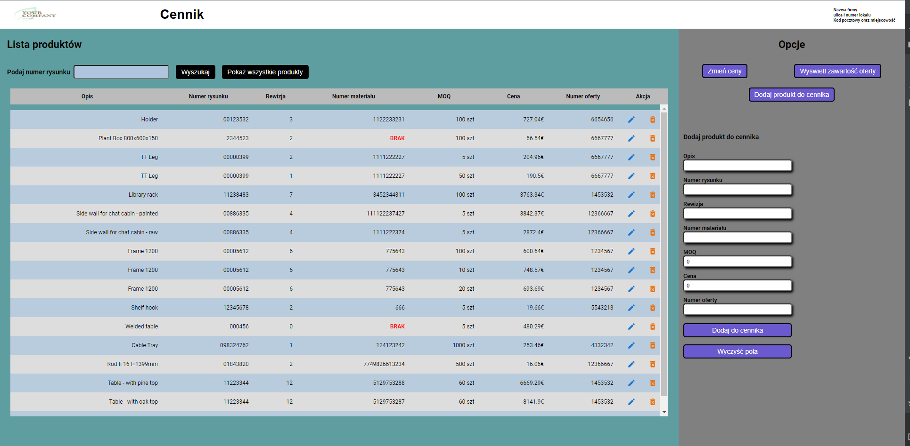

<div position="center">

</div>

# Pricebook App - FrontEnd

## Wstęp - opis


Hej! Pricebook to prosty cennik dla firm zajmujących się produkcją elementów stalowych.<br> Aplikację stworzyłem na własne potrzeby zawodowe, do szybkiej identyfikacji cen produktów na podstawie numeru rysunku technicznego.
<br>Powinna się sprawdzić nie tylko w przypadku mojego pracodawcy, ale także w innych przedsiębiorstwach zajmujących się szeroko rozumianą obróbką stali.
Główne funcjonalności:
- wyświetlanie zawartości cennika,
- wyszukiwanie rekordów po numerze rysunku,
- dodawanie nowych produktów do cennika,
- usuwanie produktów,
- edytowanie produktów,
- globalna zmiana cen na podstawie wskazanej podwyżki/obniżki procentowej,
- wyświetlanie zawartości oferty handlowej,


## Demo

[](https://youtu.be/tKWCImPtX8c)


## Technologia

<div display="flex" flex-direction="row" align-items="center">
 


</div>


## Dodatkowe paczki + wersja
  ### Dependencies
- @emotion/react 11.10.4,
- @emotion/styled 11.10.4,
- @mui/icons-material 5.10.6,
- @mui/material 5.10.8,
- @testing-library/jest-dom 5.16.4,
- @testing-library/react 13.3.0,
- @testing-library/user-event 13.5.0,
- @types/jest 27.5.2,
- @types/node 16.11.42,
- @types/react 18.0.14,
- @types/react-dom 18.0.5,
- react 18.2.0,
- react-dom 18.2.0,
- react-loader-spinner 5.3.4,
- react-router-dom 6.3.0,
- react-scripts 5.0.1,
- typescript 4.7.4,
- web-vitals 2.1.4.


### DevDependencies
- customize-cra 1.0.0,
- react-app-rewire-alias 1.1.7.


## Instalacja

```bash
$ npm install
```


## Uruchamianie


```bash

$ npm start

```
